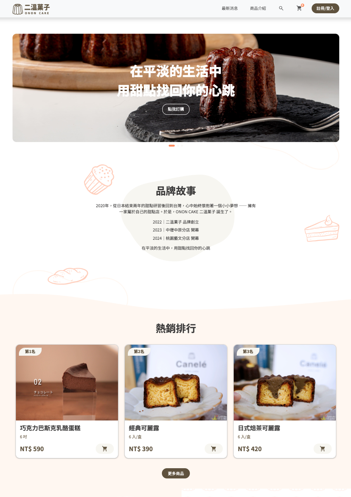
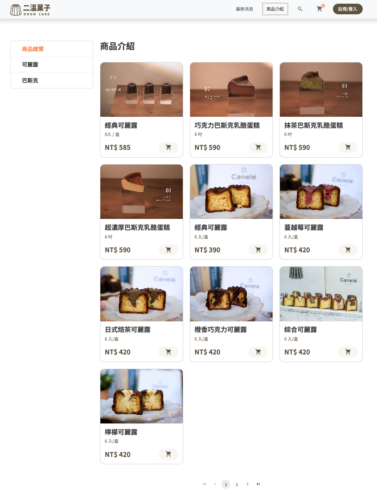
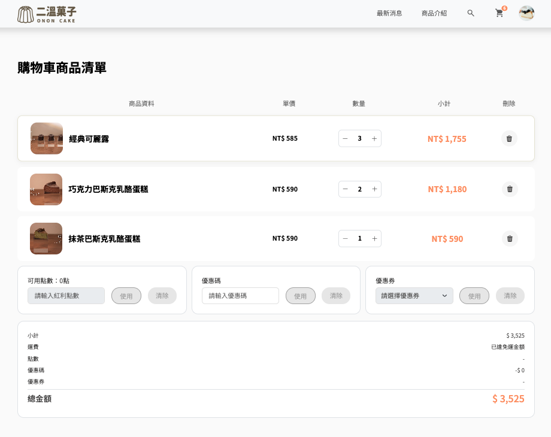
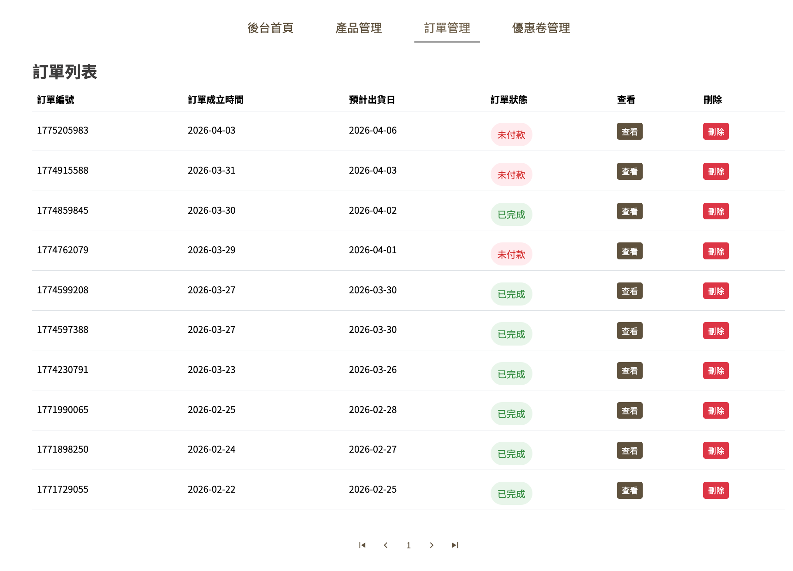

## 甜點電商網站

這是一個模擬真實電商網站的前端專案作品。<br>
前台提供使用者瀏覽商品、加入購物車並送出訂單的功能，著重於狀態管理與使用者操作體驗。<br>
後台提供管理者管理商品、訂單及優惠卷的功能。<br>

---

## Demo

<a href='https://elvina60606.github.io/ecw-project/#/' 
   style="display:inline-block; padding:10px 20px; background-color:#FFB6C1; color:white; text-decoration:none; border-radius:5px;"
   target='_blank'>
看看Demo
</a>

---

## 功能介紹

- 商品列表頁瀏覽（支援分類篩選）
- 商品詳細頁展示
- 購物車功能（新增 / 刪除商品，可即時更新畫面）
- 會員註冊與登入，可使用會員功能瀏覽訂單狀態
- 響應式設計（支援手機與桌面）

---

## 🛠 技術架構

- **Frontend**：React + Vite (SPA / CSR)
- **狀態管理**：Redux Toolkit
- **路由管理**：React Router
- **表單處理**：React-hook-form
- **UI 設計**：Bootstrap / CSS
- **其他工具**：Axios / React-loader-spinner / Swiper

---

## 📌 專案亮點

- 以 Redux Toolkit 管理購物車全域狀態，確保資料一致性
- 元件化設計，提高專案可維護性與擴展性
- 使用 react-hook-form 優化表單效能與驗證流程
- 即時更新 UI，提升使用者操作體驗

---

## 📁 專案結構

```
src/
├── components/   # 可重用元件
├── views/        # 前後台頁面
├── route/        # 路由管理
├── slices/       # Redux 狀態管理
├── layout/       # 共用版面與樣板
├── data/         # JSON檔及相關資料
├── assets/       # scss 及靜態資源（圖片、圖示等）
```

---

## 📸 畫面截圖

首頁圖 <br>
<br>

商品列表 <br>
<br>

購物車 <br>
<br>

後台訂單管理 <br>
<br>

---

## 🚀 未來優化方向

- 會員中心與修改會員資料頁面
- 導入付款流程（如金流模擬）
- 優化效能（例如：lazy loading）
